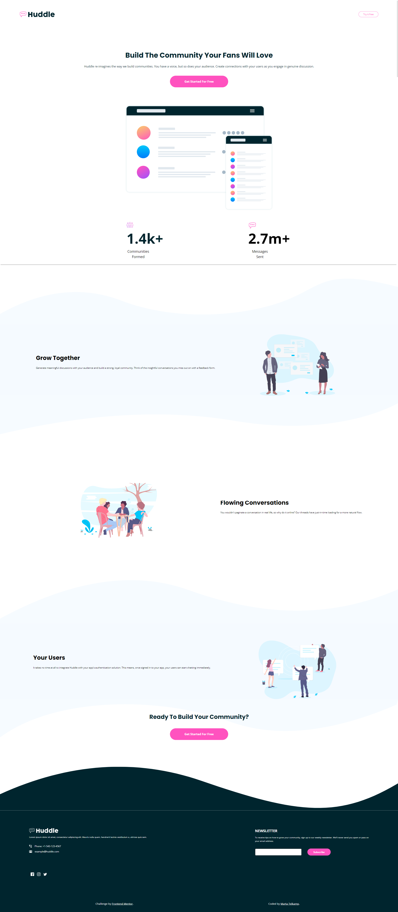

# Frontend Mentor - Huddle landing page with curved sections solution

This is a solution to the [Huddle landing page with curved sections challenge on Frontend Mentor](https://www.frontendmentor.io/challenges/huddle-landing-page-with-curved-sections-5ca5ecd01e82137ec91a50f2). Frontend Mentor challenges help you improve your coding skills by building realistic projects. 

## Table of contents

- [Overview](#overview)
  - [The challenge](#the-challenge)
  - [Screenshot](#screenshot)
  - [Links](#links)
- [My process](#my-process)
  - [Built with](#built-with)
  - [What I learned](#what-i-learned)
  - [Continued development](#continued-development)
- [Author](#author)

**Note: Delete this note and update the table of contents based on what sections you keep.**

## Overview

### The challenge

Users should be able to:

- View the optimal layout for the site depending on their device's screen size
- See hover states for all interactive elements on the page

### Screenshot

### Links

- Solution URL: [Solution](https://github.com/idlehands1969/huddle-landing-page/blob/521c2a1c7d394858e0f927000259a5b264395048/index.html)
- Live Site URL: [Live Site]([https://your-live-site-url.com](https://idlehands1969.github.io/huddle-landing-page/))

## My process

### Built with

- HTML/CSS
- Flexbox
- Mobile-first workflow

### What I learned

I am continually amazed by how long it takes me to accomplish the goals set forth by the challenges. I learn quickly and retain what I learn, but to get the CSS to do what I want it to do is a constantly evolving process. I am always going back and rewriting the CSS to look "pretty". I get the challenges done in the end. Is this normal? Will I get faster just by doing things over and over?

### Continued development

I like how I set up the colors and typography, and plan to continue doing them this way because it leaves me free to write the rest of the CSS to size and place elements.

## Author

- Website - [Marta Telkamp](https://iknittheweb.com)
- Frontend Mentor - [@idlehands1969](https://www.frontendmentor.io/profile/idlehands1969)
